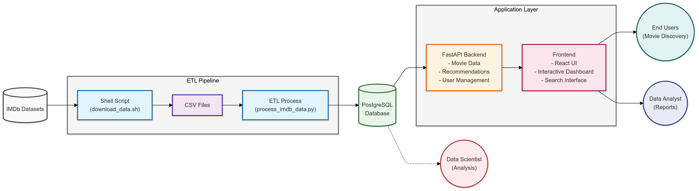
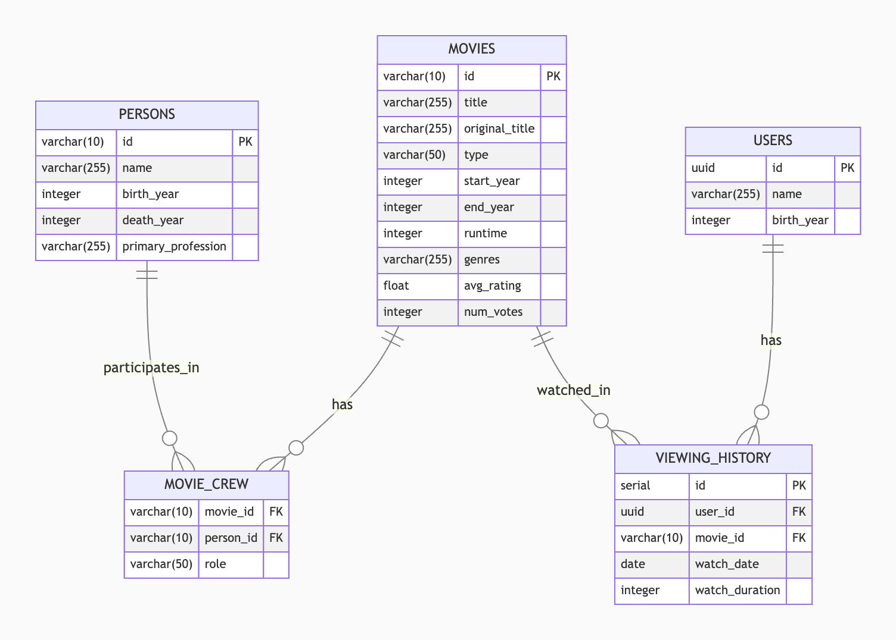

# Netflix-like Recommender System

## Project Overview

This project implements a Netflix-like recommender system using Python, Flask, and PostgreSQL. It processes IMDb datasets to create a movie recommendation engine with a RESTful API. The PostgreSQL database runs in a Docker container for easy setup and portability.

## Architecture Diagram




## Entity-Relationship Diagram (ERD)



## Table of Contents

1. [Features](#features)
2. [Prerequisites](#prerequisites)
3. [Installation](#installation)
4. [Database Setup](#database-setup)
5. [Usage](#usage)
6. [API Endpoints](#api-endpoints)
7. [Data Processing](#data-processing)
8. [Database Schema](#database-schema)
9. [Recommendation Algorithm](#recommendation-algorithm)
10. [Docker Commands](#docker-commands)
11. [Testing](#testing)
12. [Future Improvements](#future-improvements)

## Features

- ETL process for IMDb datasets
- Movie information storage and retrieval
- User viewing history tracking
- Content-based movie recommendations
- RESTful API for accessing movie data and recommendations
- Dockerized PostgreSQL database

## Prerequisites

- Python 3.12+
- Docker
- Docker Compose

## Installation

1. Clone the repository:
   ```
   git clone https://github.com/vytautas-bunevicius/recommendation-engine.git
   cd recommendation-engine
   ```

2. Set up a virtual environment:
   ```
   python -m venv venv
   source venv/bin/activate  # On Windows, use `venv\Scripts\activate`
   ```

3. Install dependencies:
   ```
   pip install -r requirements.txt
   ```

4. Start the PostgreSQL database using Docker Compose:
   ```
   docker-compose up -d
   ```
   This will start a PostgreSQL container with the necessary configurations.

5. Wait for a few seconds to ensure the database is fully up and running.

## Database Setup

After starting the Docker container, create the database schema:

1. Ensure you're in the project root directory.

2. Run the following command to execute the schema.sql file in the PostgreSQL container:
   ```
   docker-compose exec -T db psql -U postgres -d recommendation_engine < src/database/schema.sql
   ```

3. You should see output indicating that the tables and indexes have been created successfully.

## Usage

1. Download and process IMDb data:
   ```
   bash scripts/download_data.sh
   python scripts/process_imdb_data.py
   ```

2. Generate synthetic user data (optional):
   ```
   python scripts/generate_user_data.py
   ```

3. Start the Flask API server:
   ```
   python src/api/main.py
   ```

The API will be available at `http://localhost:5000`.

## API Endpoints

- `GET /movies`: Retrieve a list of movies
- `GET /movies/<movie_id>`: Get details of a specific movie
- `GET /movies/search`: Search for movies by title
- `GET /users/<user_id>`: Get user information
- `GET /users/<user_id>/viewing_history`: Get a user's viewing history
- `GET /users/<user_id>/recommendations`: Get personalized movie recommendations
- `GET /movies/<movie_id>/similar`: Get similar movies

For detailed API documentation, refer to the `src/api` directory.

## Data Processing

The project uses IMDb datasets, which are processed using the following steps:

1. Download TSV files from IMDb
2. Convert TSV files to CSV format
3. Process CSV files and insert data into PostgreSQL

For more details, see `scripts/download_data.sh` and `scripts/process_imdb_data.py`.

## Database Schema

The PostgreSQL database includes the following main tables:

- `movies`: Store movie information
- `persons`: Store information about people involved in movies
- `movie_crew`: Link movies with their crew members
- `users`: Store user information
- `viewing_history`: Track user viewing history

For the complete schema, refer to `src/database/schema.sql`.

## Recommendation Algorithm

The system uses a content-based recommendation algorithm, which considers:

- Movie genres
- User viewing history
- Movie popularity (based on number of votes)

The algorithm calculates similarity between movies using TF-IDF vectorization and cosine similarity.

For implementation details, see `src/recommender/content_based.py`.

## Docker Commands

Here are some useful Docker commands for managing the database:

- Start the database: `docker-compose up -d`
- Stop the database: `docker-compose down`
- View database logs: `docker-compose logs db`
- Access the PostgreSQL shell:
  ```
  docker-compose exec db psql -U postgres -d recommendation_engine
  ```

Remember to stop the Docker container when you're done working on the project to free up resources.

## Testing

(Note: Comprehensive tests are not yet implemented)

To run tests (once implemented):

```
python -m unittest discover tests
```

## Future Improvements

- Implement user authentication and authorization
- Develop a frontend interface for the recommender system
- Add collaborative filtering to the recommendation algorithm
- Implement caching to improve API performance
- Set up continuous integration and deployment (CI/CD)
- Add comprehensive unit and integration tests
