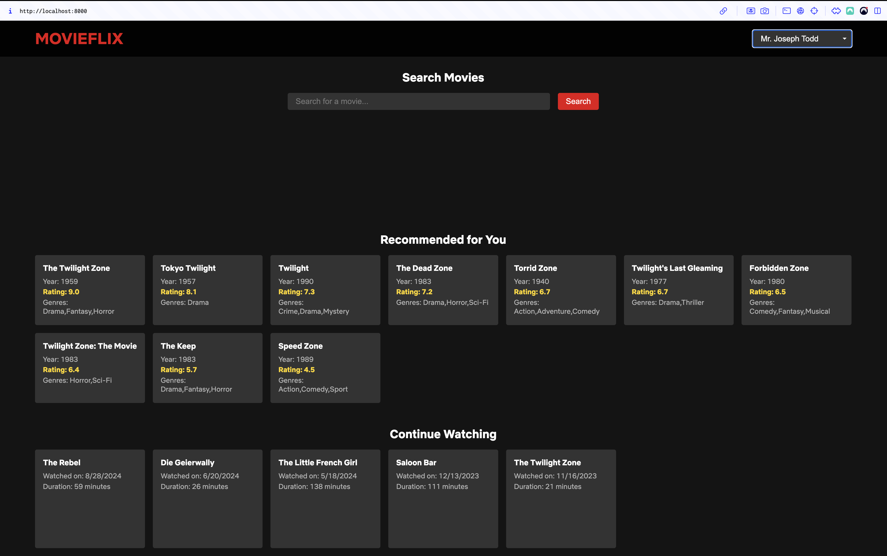

# Recommendation Engine

## Project Overview

This project implements a Netflix-like recommender system using Python, FastAPI, and PostgreSQL on AWS RDS. It processes IMDb datasets to create a movie recommendation engine with a RESTful API and a user-friendly frontend interface. The PostgreSQL database is hosted on Amazon RDS for improved scalability, reliability, and management.

## Architecture Diagram


## Entity-Relationship Diagram (ERD)


## Table of Contents

1. [Features](#features)
2. [Prerequisites](#prerequisites)
3. [Installation](#installation)
4. [Environment Setup](#environment-setup)
5. [Database Setup](#database-setup)
6. [Data Processing](#data-processing)
7. [Synthetic User Data Generation](#synthetic-user-data-generation)
8. [Running the Application](#running-the-application)
9. [Frontend UI](#frontend-ui)
10. [API Endpoints](#api-endpoints)
11. [Database Schema](#database-schema)
12. [Recommendation Algorithm](#recommendation-algorithm)
13. [AWS RDS Configuration](#aws-rds-configuration)
14. [Testing](#testing)
15. [Troubleshooting](#troubleshooting)
16. [Future Improvements](#future-improvements)

## Features

- ETL process for IMDb datasets
- Comprehensive PostgreSQL database schema for movies, persons, and user interactions
- Synthetic user data generation with viewing history
- Content-based movie recommendations
- RESTful API built with FastAPI for accessing movie data and recommendations
- User-friendly frontend interface for interacting with the recommender system
- AWS RDS PostgreSQL database for enhanced scalability and management
- Detailed logging and error handling for robust data processing

## Prerequisites

- Python 3.12+
- AWS account with RDS access
- Docker (for local development and testing)
- Git
- PostgreSQL client (e.g., `psql`) for database interactions

## Installation

1. **Clone the Repository:**
   ```bash
   git clone https://github.com/vytautas-bunevicius/recommendation-engine.git
   cd recommendation-engine
   ```

2. **Set Up a Virtual Environment:**
   ```bash
   python3 -m venv venv
   source venv/bin/activate  # On Windows, use `venv\Scripts\activate`
   ```

3. **Install the Project:**
   ```bash
   # Install the project and its dependencies
   pip install -e .

   # For development dependencies
   pip install -e ".[dev]"
   ```

## Environment Setup

1. **Create a `.env` File:**

   In the project root directory, create a `.env` file with the following content:

   ```env
   DB_NAME=recommendation_engine
   DB_USER=your_rds_username
   DB_PASSWORD=your_rds_password
   DB_HOST=your-rds-endpoint.rds.amazonaws.com
   DB_PORT=5432
   DATA_DIR=data
   BATCH_SIZE=5000
   MAX_WORKERS=5
   ```

   - **DB_NAME:** Name of your PostgreSQL database.
   - **DB_USER:** Your AWS RDS PostgreSQL username.
   - **DB_PASSWORD:** Your AWS RDS PostgreSQL password.
   - **DB_HOST:** Your AWS RDS endpoint.
   - **DB_PORT:** PostgreSQL port (default is `5432`).
   - **DATA_DIR:** Directory where IMDb data will be stored.
   - **BATCH_SIZE:** Number of records to process in each batch during data processing.
   - **MAX_WORKERS:** Number of threads for parallel processing.

2. **Load Environment Variables:**

   Ensure that your environment variables are loaded. The provided scripts and modules use the `python-dotenv` package to automatically load variables from the `.env` file.

## Database Setup

1. **Ensure Access to Your AWS RDS Instance:**

   - Verify that your AWS RDS PostgreSQL instance is up and running.
   - Confirm that the security group attached to your RDS instance allows inbound traffic on port `5432` from your IP address.

2. **Create the Database Schema:**

   Execute the SQL schema to set up the necessary tables.

   ```bash
   psql -h your-rds-endpoint.rds.amazonaws.com -U your_rds_username -d recommendation_engine -f src/database/schema.sql
   ```

   Enter your RDS password when prompted.

## Data Processing

1. **Download IMDb Data:**

   Run the provided script to download IMDb datasets.

   ```bash
   bash scripts/download_data.sh
   ```

2. **Process IMDb Data:**

   Execute the data processing script to populate the `movies`, `persons`, and related tables.

   ```bash
   python3 scripts/process_imdb_data.py
   ```

   *Ensure that this step completes successfully before proceeding to synthetic user data generation.*

## Synthetic User Data Generation

1. **Generate Synthetic Users and Viewing History:**

   Run the user data generation script to populate the `users` and `viewing_history` tables.

   ```bash
   python3 scripts/generate_user_data.py --num_users 10000 --num_views 100000
   ```

   *Adjust the `--num_users` and `--num_views` parameters as needed.*

   **Script Features:**
   - **Batch Processing:** Inserts data in batches of 1000 records for efficiency.
   - **Conflict Handling:** Skips duplicate user entries gracefully.
   - **Logging:** Detailed logs are maintained in `user_data_generation.log` for monitoring progress and troubleshooting.

## Running the Application

1. **Start the FastAPI Server:**

   ```bash
   uvicorn src.api.main:app --host 0.0.0.0 --port 8000 --reload
   ```

   - **--host 0.0.0.0:** Makes the server accessible externally.
   - **--port 8000:** Specifies the port number.
   - **--reload:** Enables auto-reloading on code changes (useful for development).

   The API will be available at `http://localhost:8000`.

2. **Access the API Documentation:**

   FastAPI automatically generates interactive API documentation. Access it at:

   - Swagger UI: `http://localhost:8000/docs`
   - ReDoc: `http://localhost:8000/redoc`

## Frontend UI

1. **Access the Frontend Interface:**

   The frontend UI is served by the FastAPI server. Open your web browser and navigate to:

   ```
   http://localhost:8000/
   ```

   This interface allows users to:

   - Select a user to view personalized recommendations and viewing history.
   - Search for movies by title.
   - View details of recommended and similar movies.

2. **Frontend Structure:**

   - **HTML:** Located at `src/ui/index.html`
   - **CSS:** Located at `src/ui/styles.css`
   - **JavaScript:** Located at `src/ui/script.js`

   The frontend interacts with the backend API to fetch and display data dynamically.

3. **UI Screenshot:**

   

## API Endpoints

### Movies

- `GET /movies`: Retrieve a list of movies
- `GET /movies/{movie_id}`: Get details of a specific movie
- `GET /movies/search`: Search for movies by title
- `GET /movies/{movie_id}/similar`: Get similar movies

### Users

- `GET /users`: Retrieve a list of users
- `GET /users/{user_id}`: Get user information
- `GET /users/{user_id}/viewing_history`: Get a user's viewing history
- `POST /users/{user_id}/viewing_history`: Add a viewing history entry for a user

### Recommendations

- `GET /users/{user_id}/recommendations`: Get personalized movie recommendations

For detailed API documentation, refer to the interactive docs available at `/docs` or `/redoc` when the server is running.

## Database Schema

The AWS RDS PostgreSQL database includes the following main tables:

- `movies`: Store movie information
- `persons`: Store information about people involved in movies
- `movie_crew`: Link movies with their crew members
- `directors`: Store director information
- `writers`: Store writer information
- `known_for_titles`: Link persons with movies they are known for
- `users`: Store user information
- `viewing_history`: Track user viewing history
- `movie_ratings`: Store movie ratings

**Indexes:**
- Multiple indexes are created to improve query performance, such as on movie titles, user IDs, viewing dates, and more.

For the complete schema, refer to `src/database/schema.sql`.

## Recommendation Algorithm

The system uses a content-based recommendation algorithm, which considers:

- **Movie Genres:** Analyzes genres to find similar movies.
- **User Viewing History:** Considers movies a user has watched to recommend similar titles.
- **Movie Popularity:** Takes into account the number of votes and average ratings.

The algorithm calculates similarity between movies using TF-IDF vectorization and cosine similarity.

For implementation details, see `src/recommender/content_based.py`.

## AWS RDS Configuration

To set up and configure AWS RDS:

1. **Create an AWS Account:**
   - If you don't have one, sign up at [AWS](https://aws.amazon.com/).

2. **Set Up an RDS PostgreSQL Instance:**
   - Navigate to the RDS service in the AWS Management Console.
   - Launch a new PostgreSQL instance with the desired configurations.
   - Ensure that the security group allows inbound traffic on port `5432` from your IP address.

3. **Configure Database Credentials:**
   - Set up the master username and password.
   - Update the `.env` file in your project with the RDS instance details.

4. **Backup and Maintenance:**
   - Configure automated backups and maintenance windows as needed.

For detailed AWS RDS setup instructions, refer to the [AWS RDS Documentation](https://docs.aws.amazon.com/AmazonRDS/latest/UserGuide/CHAP_PostgreSQL.html).

## Testing

_Comprehensive tests are not yet implemented._

To run tests (once implemented):

```bash
python -m unittest discover tests
```

## Troubleshooting

### Common Issues

1. **Empty `movies` Table:**
   - **Symptom:** Error during viewing history generation stating no movies found.
   - **Solution:** Ensure that IMDb data has been processed and the `movies` table is populated before running the user data generation script.
     ```bash
     python3 scripts/process_imdb_data.py
     ```

2. **Database Connection Errors:**
   - **Symptom:** Unable to connect to AWS RDS PostgreSQL instance.
   - **Solution:**
     - Verify that your `.env` file has the correct RDS credentials and endpoint.
     - Ensure that the security group allows inbound traffic from your IP on port `5432`.
     - Check AWS RDS instance status to ensure it's available.

3. **Duplicate User Entries:**
   - **Symptom:** Warnings about duplicate user IDs.
   - **Solution:** The script is designed to handle duplicates gracefully using `ON CONFLICT DO NOTHING`. If duplicates are frequent, consider verifying the UUID generation or adjusting the script parameters.

4. **Insufficient Permissions:**
   - **Symptom:** Errors related to table creation or data insertion.
   - **Solution:** Ensure that the RDS user specified in the `.env` file has the necessary permissions to create tables and insert data.

### Reviewing Logs

- **User Data Generation Logs:**
  Check the `user_data_generation.log` file for detailed logs and error messages.
  ```bash
  tail -f user_data_generation.log
  ```

- **Data Processing Logs:**
  Check the `data_processing.log` file for insights into data processing steps.
  ```bash
  tail -f data_processing.log
  ```

- **API Server Logs:**
  Monitor the terminal where the FastAPI server is running for real-time logs.

## Future Improvements

- **User Authentication and Authorization:** Implement secure user login and access controls.
- **Enhanced Frontend Interface:** Develop a more feature-rich and responsive web interface.
- **Collaborative Filtering:** Enhance the recommendation algorithm by incorporating collaborative filtering techniques.
- **Caching Mechanisms:** Implement caching (e.g., Redis) to improve API response times.
- **Continuous Integration and Deployment (CI/CD):** Set up pipelines for automated testing and deployment.
- **Comprehensive Testing:** Develop unit and integration tests to ensure system reliability.
- **Auto-scaling:** Configure auto-scaling for the API using AWS Elastic Beanstalk or ECS to handle varying loads.
- **Monitoring and Alerting:** Integrate AWS CloudWatch for real-time monitoring and alerts on system performance and issues.
- **Dockerization:** Containerize the application for easier deployment and scalability.
- **Advanced Search Features:** Implement more sophisticated search capabilities, such as fuzzy search or filtering by multiple criteria.

---
